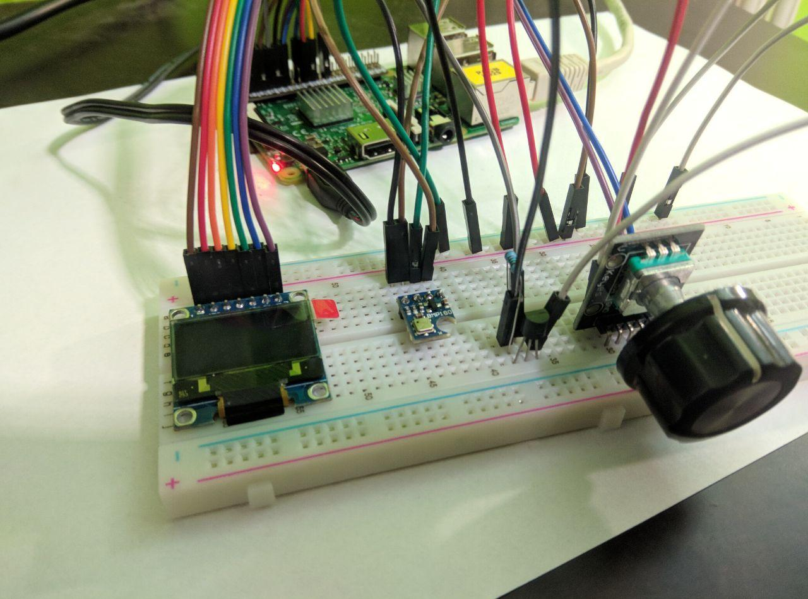
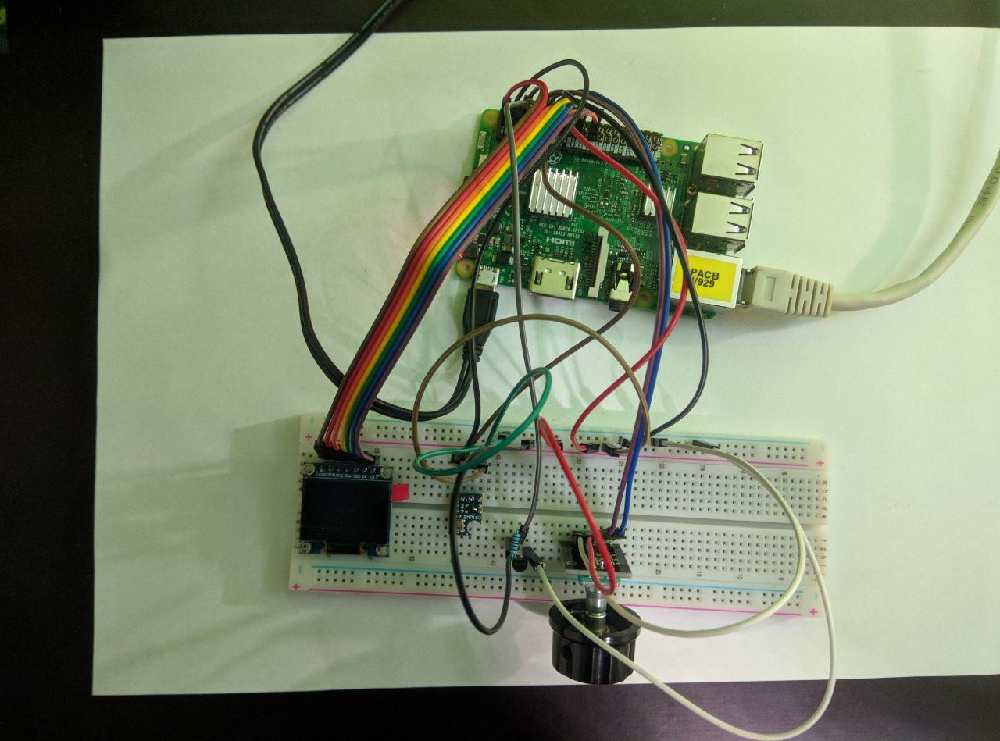

# NAG-IoT
## Úžlabinští poníci

Aplikace zobrazí na OLED displeji následující informace:
* Čas
* Datum
* Přípojení k serveru (pomocí GET requestu)
* Teplotu ze senzoru Dallas DS18B20
* Teplotu ze senzoru BMP180
* Tlak
* Nadmořskou výšku
* Verzi linux kernelu

Mezi informacemi se dá posouvat pomocí rotačního enkodéru a to na obě strany.
Při posouvání se na displeji zobrazuje na jaké obrazovce se uživatel nachází.

Teplota ze senzoru Dallas DS18B20 a přípojení k serveru se aktualizují každých 5 minut (kvůli zatížení systému), ostatní hodnoty pokaždé když se zobrazují.

Aplikace se spouští příkazem `$ sudo python display.py`

## Připojení pinů

|Zařízení|GPIO|
|--------|----|
|**Displej** RES|24|
|Displej DC|23|
|Displej SCK|11|
|Displej CS|8|
|Displej SDA|10|
|**BMP 180** SDA|2|
|BMP 180 SCL|3|
|**Dallas** DS18B20|4|
|**Rot. En.** CLK|17|
|Rot. En. DT|18|

## Demo

## Zdroje:
[Dallas DS18B20](https://pimylifeup.com/raspberry-pi-temperature-sensor/)  
[Fonty](https://tech.scargill.net/ssd1306-with-python/)  

## Knihovny:
[Adafruit SD 1306](https://learn.adafruit.com/ssd1306-oled-displays-with-raspberry-pi-and-beaglebone-black)  
[Adafruit BMP180](https://learn.adafruit.com/using-the-bmp085-with-raspberry-pi/using-the-adafruit-bmp-python-library)  
[RPi.GPIO](https://pypi.org/project/RPi.GPIO/)  
[Requests](http://docs.python-requests.org/en/master/)  
