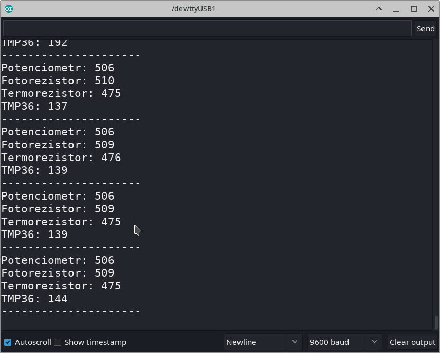
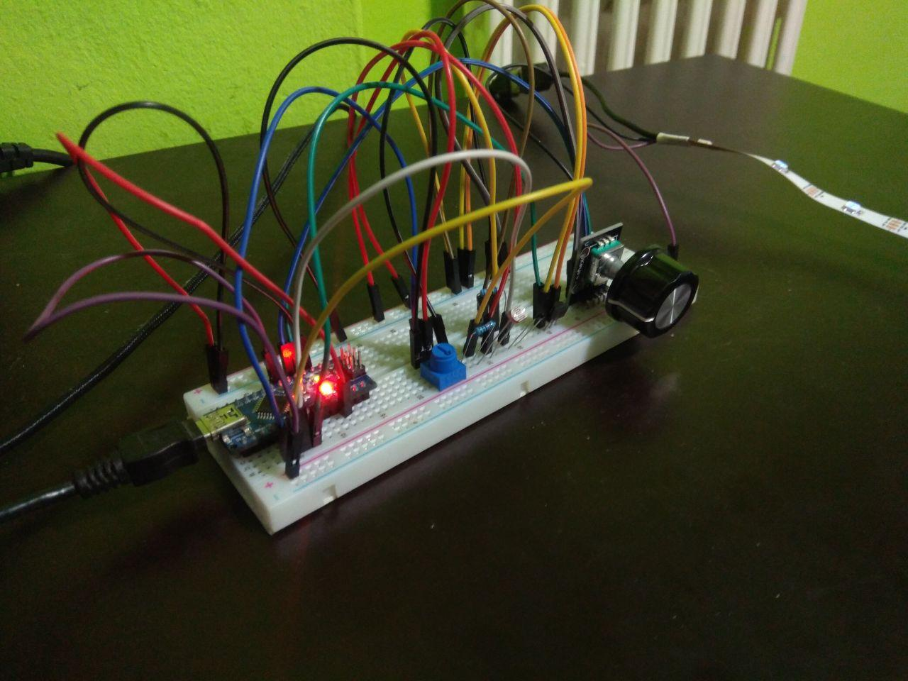

# NAG-IoT
## Úžlabinští Poníci

Program čte analogové hodnoty ze senzorů a zobrazuje je na led pasku, prepíná se mezi nimi pomocí rotačního enkoderu.
 
Barvy ledek:
	Zelená - Potenciometr
	Žlutá - Fotodioda
	Modrá - Termistor
	Červená - TMP36
 
Každou +- 1 vteřinu se do seriového monitoru vypíšou hodnoty. Hodnoty ze senzoru se na LED pasku aktualizují každých 200ms.

Vše jsem zapojil do arduina (viz ../05/zapojeni.png a zapojeni.jpg). Pro napájení led pásku používám starou nabíječku od mobilu (na led pásek jsem napájel USB konektor a zem nabíječky spojil se zemí arduina), protože arduino nezvládne ze svých pinů dodávat takový proud.

|Součástka|Pin|
|---------|---|
|LED data|5|
|ENCODER DT|2|
|ENCODER CLK|3|

[Video Demo](https://youtu.be/DfEPtM-2sAY)

## Použité knihovny
[FastLED](http://fastled.io/)

