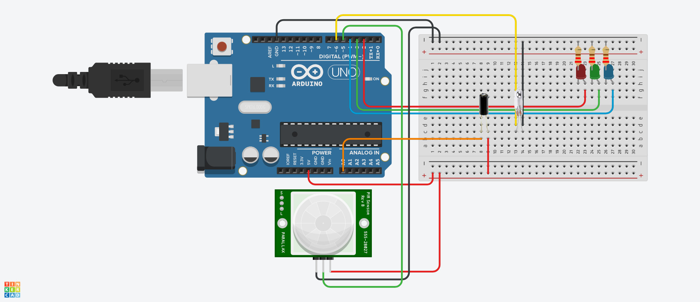

# NAG-IoT
## Úžlabinští Poníci

Program rozbliká led pokud detekuje pohyb, vibrace, nebo otočení.
Barvy led:
	Červená - senzor otřesu
	Zelená - senzor polohy (otočení)
	Modrá - senzor pohybu (pir)

Pokud arduino zaznamená otočení rozsvítí zelenou diodu na 1 sekundu.
Na senzoru pohybu je malá odezva (není napsána v kódu, ale senzoru chvíli trvá, než pohub detekuje)

[Video Demo](https://youtu.be/4nC16f-9Dn8)

